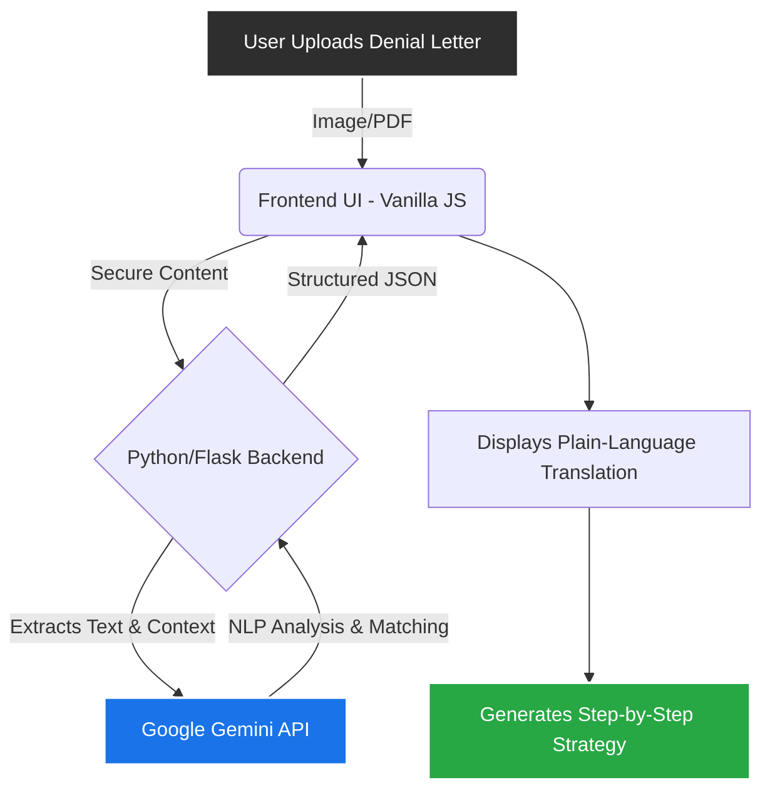
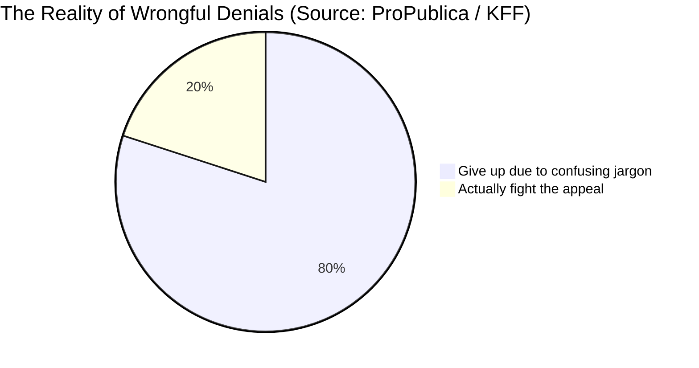
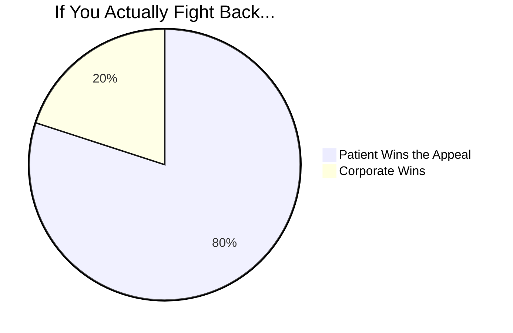

  
  <h1>UnDenied</h1>
  <h3>The AI-Powered Legal Translator & Appeal Strategist</h3>
  
<em>Official Submission for the <strong>Creator Colosseum Startup Competition</strong></em>

  <!-- Badges -->
  

    
    
    
    
  

  

    <strong>Built by a solo student founder to level the playing field against billion-dollar corporations.</strong> 
    <em>"They expect you to give up. I make sure you don't."</em>
  

   

---

##  The Pitch in 30 Seconds

> **The Problem:** 80% of people never appeal wrongful determinations (insurance, medical, eviction) because corporate lawyers intentionally write them in confusing, intimidating legalese. 
> **The Solution:** UnDenied takes that jargon and instantly translates it into a plain-language, step-by-step tactical appeal strategy using cutting-edge AI.

### The Hustle Behind the Code
I didn't use a drag-and-drop website builder. I didn't rely on existing frameworks. Driven by the mission to stop vulnerable people from being bullied by bureaucracy, I spent countless late nights teaching myself to hand-code a cinematic UI in pure Vanilla JS and CSS, integrating it with a custom Python backend and Google's Gemini API from absolute scratch.

---

##  Competition Questionnaire 

###  What is your startup idea?
**UnDenied** is a civic-tech web application that instantly translates intimidating legal documents—like predatory medical bills, wrongful eviction notices, and bad-faith insurance denials—into actionable, jargon-free appeal strategies using AI.

###  What is the problem you are solving and why it matters?
Corporations rely on "Appeal Fatigue." They know if they make the paperwork confusing enough, people will just pay the bill or walk away. 
*  **The Reality:** 80% of people give up immediately because they don't understand the letter.
*  **The Shocking Truth:** Of the 20% who *do* fight back, **up to 80% win their cases.** 
*  *(Sources backed by: ProPublica Healthcare Investigations, Kaiser Family Foundation (KFF), and the Consumer Financial Protection Bureau).*

This information asymmetry disproportionately hurts low-income families, immigrants, and the elderly. UnDenied exists to arm them.

###  What is your solution and how does it work?
We automate the legal discovery and strategy phase for the average consumer. 

**The UnDenied Workflow:**
1. **Upload:** User securely drops in a PDF or image of their denial letter.
2. **AI Parse:** The Gemini engine parses the document, extracting the core legal grounds and hidden deadlines.
3. **Translate:** Outputs a highly-digestible, plain-language explanation of what the letter *actually* means.
4. **Strategize:** Generates a custom, step-by-step tactical playbook on exactly how to fight back and win the appeal.

###  What is your execution and business plan?
My roadmap scales value from individuals up to enterprise organizations with zero friction:
* **Phase 1: Validation & Data (Current):** A live, free public beta. The goal is to gather proprietary, anonymized data on systemic regional denial patterns while building massive consumer trust.
* **Phase 2: B2C Freemium:** Translation remains permanently free. I will introduce a $5-$10 premium tier that auto-generates formally formatted, ready-to-mail legal complaint drafts.
* **Phase 3: B2B Enterprise Licensing:** White-label the UnDenied API and license my anonymized denial data to consumer advocacy groups, labor unions, and NGOs for recurring B2B revenue.

###  Identification of your target market
* **Primary Focus:** Patients fighting predatory medical debt (an **$88 Billion** market in the US alone).
* **Secondary:** Tenants facing complex lease disputes, unjust fines, or evictions.
* **Tertiary:** Citizens navigating wrongful government benefit rejections (Unemployment, SNAP).

---

##  System Architecture

---

##  The Hard Proof: The "Denial Machine"

---

##  Technical Stack

### Frontend (Award-Winning Cinematic UI)
    

### Backend & AI Engine
  

*(Built entirely without drag-and-drop builders or bloated frameworks to maximize performance and demonstrate technical mastery).*

---

##  Pitch & Demo

*  **[Watch my 5-Minute Pitch Video Here]** *(Replace with actual link)*
*  **[View the Deployed Web App Here]** *(Replace with actual link)*
*  **[Link to GitHub Repository]** *(Replace with actual link)*

---

##  Alignment with Competition Criteria

| Core Competencies | Why UnDenied Maximizes the Rubric |
| :--- | :--- |
| **Effort and Work Ethic (40%)** | Built entirely from scratch by a solo student founder. I hand-coded the cinematic UI (bypassing templates), engineered a custom Python backend, and natively integrated live AI. The code density and complexity serve as highly measurable proof of effort. |
| **Feasibility & Execution (25%)** | This is a live, functioning application—not a Figma prototype. The 3-phase execution roadmap requires incredibly low overhead while simultaneously scaling into a highly viable Enterprise SaaS model. |
| **Potential Impact (25%)** | Directly attacks the massive "$88 Billion Med Debt" asymmetry. UnDenied provides fast, free, actionable translation that literally saves the most vulnerable users thousands of dollars and immense emotional distress. |
| **Communication & Clarity (10%)** | The entire product thesis *is* clarity. Both the application's clean UX and this pitch documentation are designed to instantly communicate complex systemic problems to non-experts. |
