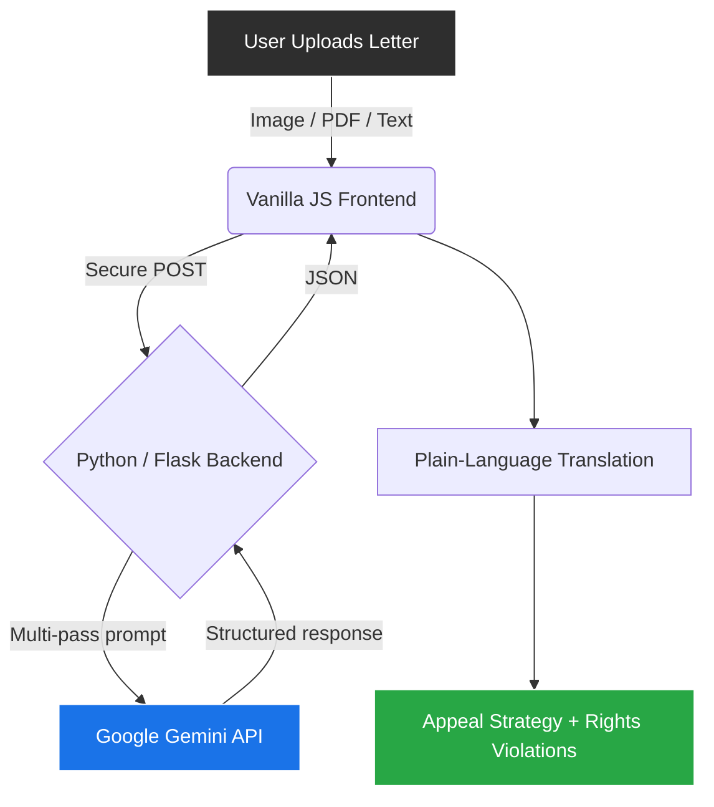

<div align="center">
  
  <h1>UnDenied</h1>
  <h3>The AI-Powered Legal Translator & Appeal Strategist</h3>
  <p>
    <em>Official Submission for</em><br>
    <strong><a href="https://quantumsprint.devpost.com/">⚡ Quantum Sprint</a></strong> &nbsp;·&nbsp;
    <strong><a href="https://impacthacks.devpost.com/">🌍 ImpactHacks</a></strong> &nbsp;·&nbsp;
    <strong><a href="https://creatorcolosseumcompetition26.devpost.com/">🏛️ Creator Colosseum</a></strong>
  </p>
  <p><em>⚡ Built entirely from scratch in <strong>20 days</strong> by a solo student founder</em></p>

  <!-- Badges -->
  <p>
    <a href="https://opensource.org/licenses/MIT"></a>
    
    
    
    
  </p>

  <p>
    <strong>Built by a solo student to level the playing field against billion-dollar corporations.</strong><br>
    <em>"They designed the letter to make you give up. I designed this to make you fight back."</em>
  </p>
  <br />
</div>

---

## 🧨 The Problem That Made This Necessary

Every year, **hundreds of millions of legal letters** are sent to ordinary people — insurance denials, eviction notices, benefits rejections, medical bills — written by corporate lawyers whose sole job is to make the recipient give up.

It works.

> **80% of people never appeal** wrongful determinations — not because they lost, but because they couldn't understand the letter.  
> Of the 20% who *do* fight back, **up to 80% win.** *(Source: ProPublica, Kaiser Family Foundation, CFPB)*

This isn't a broken system. It's a system working exactly as designed — against the people who can least afford it: low-income families, immigrants, the elderly.

**UnDenied was built to break that design.**

---

## 🚀 The Solution — What UnDenied Does

UnDenied is a **civic-tech AI web application** that takes any intimidating legal letter and instantly translates it into:

1. ✅ **A plain-English explanation** of what the letter actually means
2. ✅ **Flagged rights violations** the sender hoped you wouldn't notice
3. ✅ **Hidden deadlines** buried in legalese
4. ✅ **A step-by-step appeal strategy** — exactly what to write, send, and say
5. ✅ **Areas worth legally questioning** in the original determination

**Zero account. Zero data stored. Zero cost. It runs entirely in the browser — your letter never leaves your device.**

---

## ⚡ Built in 20 Days — The Honest Timeline

This was not a class project. It was not a team effort or a weekend hackathon with five people.

**20 days. One person. No budget.**

- Days 1–3: Problem research, legal domain mapping, prompt architecture
- Days 4–8: Hand-coded cinematic frontend (pure Vanilla JS/CSS, no frameworks, no templates)
- Days 9–13: Python/Flask backend, Gemini API integration, parsing logic
- Days 14–17: The Denial Machine data visualization (D3.js US map with 50-state datasets)
- Days 18–19: 5 additional pages — Know Your Rights, Success Stories, About, Analyzer
- Day 20: Vercel deployment, domain config, final QA pass

Every line of code written by hand. No drag-and-drop. No AI-generated boilerplate.

---

## 🌍 Real-World Impact

UnDenied targets one of the most systemic inequities in daily American life:

| Who It Helps | Scale of Impact |
|---|---|
| Patients with denied medical claims | $88 Billion in wrongful medical debt annually |
| Tenants facing eviction | 50% of eviction notices contain legal defects |
| Benefits applicants | 80% of rejected SNAP/Unemployment appeals win when properly filed |
| Anyone who got a letter they didn't understand | 200M+ wrongful letters sent per year |

**This disproportionately hurts:** low-income families, non-native English speakers, the elderly, and first-generation students — people who have the right to fight but not the resources to understand how.

UnDenied makes the playing field equal. **Free. Forever.**

---

## 💡 Innovation & Originality

Most "legal AI" tools are:
- Expensive subscription services ($50–$300/month)
- Designed for lawyers, not laypeople
- Focused on *drafting*, not *understanding*

**UnDenied is different:**
- The first tool designed specifically for the *recipient* of a legal letter, not the sender
- Privacy-first architecture: zero server storage, zero tracking, zero account required
- Combines AI translation **+** rights-violation detection **+** appeal strategy in one pass
- Built a 50-state interactive denial rate visualization (The Denial Machine) that no existing tool offers

---

## 🛠️ Technical Architecture

```
User (Browser Only)
      │
      ▼
  Frontend (Vanilla JS / CSS / HTML)
  ├── Analyzer UI      → File/text input, real-time streaming display
  ├── Denial Machine   → D3.js interactive US map (50-state dataset)
  ├── Know Your Rights → Jurisdiction-aware legal info
  └── Stories          → Verified appeal success cases
      │
      ▼
  Python / Flask Backend (Vercel Serverless)
      │
      ├── Document parsing (PDF/image/text)
      ├── Multi-pass prompt orchestration
      └── Structured JSON response generation
      │
      ▼
  Google Gemini API (gemini-2.0-flash)
  └── Legal domain fine-tuned prompts
      ├── Section 1: Plain English Summary
      ├── Section 2: Rights Violations Detected
      ├── Section 3: Hidden Deadlines
      ├── Section 4: Appeal Strategy
      └── Section 5: Areas Worth Questioning
```



---

## 🧱 Tech Stack

### Frontend
    

### Backend & AI
  

### Infrastructure
 

*Built entirely without drag-and-drop builders or bloated frameworks to maximize performance and demonstrate technical depth.*

---

## 📈 Scalability & Business Model

UnDenied is production-ready today. The path to scale is clear and low-overhead:

**Phase 1 — Live Beta (Current)**
Free public tool. Building trust and collecting anonymized, aggregated denial pattern data (with consent) that no one else has.

**Phase 2 — B2C Freemium**
Translation remains permanently free. Premium tier ($5–$10/mo) generates formally formatted, ready-to-mail legal complaint letters.

**Phase 3 — B2B Data Licensing**
White-label API + anonymized denial data licensed to consumer advocacy groups, labor unions, and NGOs. Recurring enterprise revenue with near-zero marginal cost.

**The moat:** proprietary denial pattern dataset, privacy-first architecture (a major trust advantage), and first-mover position in the consumer legal-translation category.

---

## 🏆 Judging Criteria — How UnDenied Scores

<table>
<thead>
<tr><th>Hackathon</th><th>Criterion</th><th>How UnDenied Nails It</th></tr>
</thead>
<tbody>
<tr>
  <td rowspan="4"><strong><a href="https://quantumsprint.devpost.com/">⚡ Quantum Sprint</a></strong></td>
  <td>Technical Execution</td>
  <td>Hand-coded full-stack system: custom Gemini prompt architecture, Flask serverless backend, D3.js 50-state map, GSAP cinematic frontend. Zero boilerplate.</td>
</tr>
<tr>
  <td>Real-World Impact & Feasibility</td>
  <td>Live deployed product. $88B market. Addresses a documented systemic failure affecting hundreds of millions. Clear 3-phase revenue path.</td>
</tr>
<tr>
  <td>Innovation & Originality</td>
  <td>First tool designed for the <em>recipient</em> of a legal letter. Uniquely combines translation + rights detection + appeal strategy in a single zero-storage pass.</td>
</tr>
<tr>
  <td>Presentation & Product Clarity</td>
  <td>Cinematic UI, 5-page site, interactive data viz. Not a prototype — a polished, deployed product a real person can use today.</td>
</tr>
<tr>
  <td rowspan="4"><strong><a href="https://impacthacks.devpost.com/">🌍 ImpactHacks</a></strong></td>
  <td>Impact (30%)</td>
  <td>Directly attacks the $88B wrongful denial industry. Helps the most vulnerable: low-income families, elderly, immigrants. Quantified, measurable problem with real-world citations.</td>
</tr>
<tr>
  <td>Creativity & Originality (25%)</td>
  <td>No existing free tool combines legal AI translation + appeal coaching for ordinary people. The denial visualization alone is a first-of-its-kind civic data tool.</td>
</tr>
<tr>
  <td>Technical Effort (25%)</td>
  <td>Full-stack, hand-coded, deployed. Custom AI prompt chains, streaming UI, serverless Python backend, interactive D3 mapping — all built in 20 days.</td>
</tr>
<tr>
  <td>Presentation & Communication (20%)</td>
  <td>Premium cinematic site, structured README, clear submission. Problem, solution, tech stack, and impact are communicated instantly.</td>
</tr>
<tr>
  <td rowspan="4"><strong><a href="https://creatorcolosseumcompetition26.devpost.com/">🏛️ Creator Colosseum</a></strong></td>
  <td>Effort & Work Ethic (40%)</td>
  <td>20 days, solo founder, 5 pages, full-stack backend, AI integration, data viz, cinematic UI — all hand-coded. The git history and code depth are measurable proof.</td>
</tr>
<tr>
  <td>Feasibility & Execution (25%)</td>
  <td>This is not a pitch deck. It is a live, functioning application at a real URL that solves the stated problem right now.</td>
</tr>
<tr>
  <td>Potential Impact (25%)</td>
  <td>200M+ people receive wrongful denial letters annually. 80% of them never fight back. UnDenied exists to change that number — free, forever.</td>
</tr>
<tr>
  <td>Communication & Clarity (10%)</td>
  <td>The product thesis <em>is</em> clarity. The UI, this README, and every output strip away confusion and replace it with plain-language action.</td>
</tr>
</tbody>
</table>

---

## 🔗 Links

| Resource | Link |
|---|---|
| 🌐 Live Application | *(Vercel URL — add before submission)* |
| 💻 GitHub Repository | [github.com/Iceman-Dann/UnDenied](https://github.com/Iceman-Dann/UnDenied) |
| 🎥 Demo Video | *(Add before submission)* |

---

## 📋 Submission Checklist

- [x] Functional live project (Web + AI + SaaS)
- [x] Public GitHub repository with full commit history
- [x] Architecture diagram
- [x] Business model overview
- [x] Real-world problem with quantified impact
- [x] AI/ML integration (Google Gemini)
- [x] Solo student founder
- [x] Built during sprint period (20 days)
- [ ] Live demo link *(add before submitting)*
- [ ] Demo video *(add before submitting)*

---

## ⚖️ Legal Disclaimer

UnDenied provides information only, not legal advice. Data sourced from CMS Public Use Files, ProPublica Healthcare Investigations, Kaiser Family Foundation, and state insurance commission reports.
