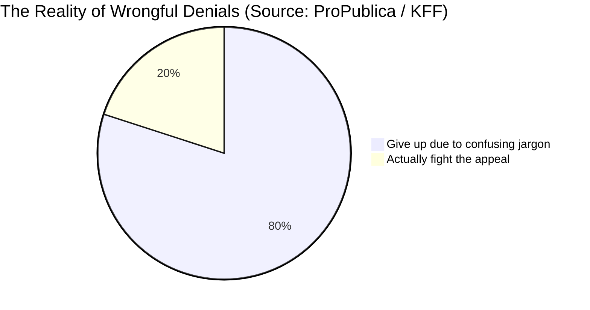
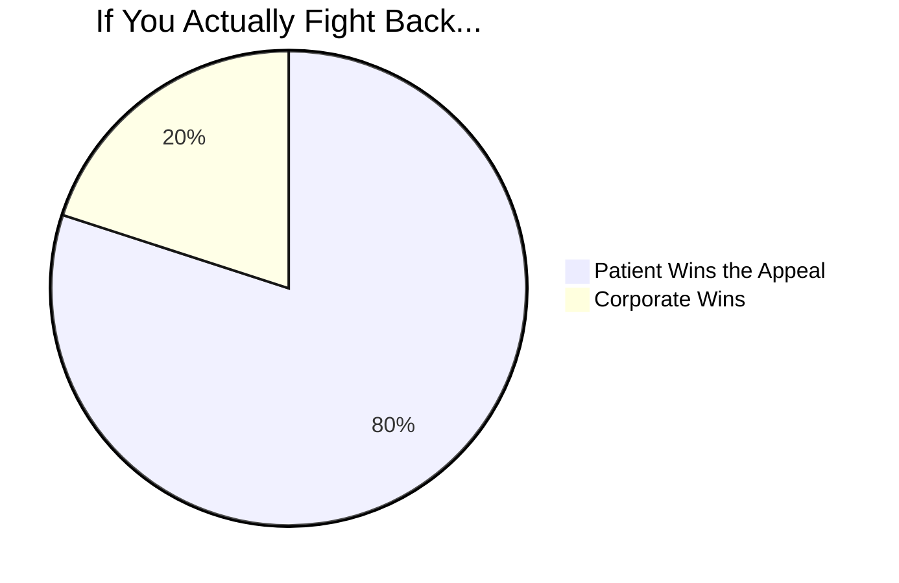

  
  <h1>UnDenied</h1>
  <h3>The AI-Powered Legal Translator & Appeal Strategist</h3>
  
<em>Official Submission for the <strong>Creator Colosseum Startup Competition</strong></em>

  
  
  
  
  
   

---

##  The TL;DR Story
* **The Spark:** As a student, I watched vulnerable people (families, elderly, immigrants) get bullied by corporate legal jargon they couldn't afford a lawyer to fight.
* **The Obsession:** I spent countless late nights building a solution from absolute scratch. 
* **The Hustle:** No template builders. No shortcuts. I hand-coded a cinematic UI in Vanilla JS/CSS and integrated Google's Gemini API with a custom Python backend.
* **The Result:** A live, deployed civic-tech platform that actually levels the legal playing field.

---

##  Required Competition Questionnaire 

### What is your startup idea?
**UnDenied** instantly translates intimidating legal documents (insurance denials, eviction notices, medical bills) into plain-language, actionable appeal strategies using AI.

### What is the problem you are solving and why it matters?
Corporations intentionally use complex legal formatting to cause "Appeal Fatigue." 
* **The Reality:** 80% of people never appeal wrongful decisions because they don't understand the letter.
* **The Shocking Truth:** Of the 20% who *do* appeal, **up to 80% win their cases.** 
* *(Sources: ProPublica Healthcare Investigations, Kaiser Family Foundation (KFF) Patient Debt Studies, Consumer Financial Protection Bureau (CFPB) Reports).*

### What is your solution and how does it work?
We automate the legal discovery process:
1. **Upload:** User drops in a PDF/Image of their denial letter.
2. **AI Parse:** Gemini API extracts legal grounds and hidden deadlines.
3. **Translate:** Outputs a jargon-free explanation.
4. **Strategize:** Generates a custom, step-by-step tactical playbook to win the appeal.

### What is your execution/business plan?
* **Phase 1 (Now):** Live, free public beta. Goal: Gather anonymized data on systemic denial patterns and build immense user trust.
* **Phase 2 (B2C Freemium):** Translation remains free. $5-$10 premium tier auto-generates physical, ready-to-mail legal complaint drafts.
* **Phase 3 (B2B Enterprise):** White-label the API and license our anonymized data to consumer advocacy groups, NGOs, and legal aid clinics for recurring revenue.

### Identification of your target market
* **Primary:** Patients fighting predatory medical debt ($88 Billion US Market).
* **Secondary:** Tenants facing complex lease disputes/evictions.
* **Tertiary:** Citizens navigating wrongful government benefit rejections.

---

##  The Hard Proof: The "Denial Machine"

*UnDenied exists solely to flip these metrics.*

---

##  Technical Implementation
* **Frontend:** Hand-coded HTML5, CSS3, ES6+ JavaScript.
* **Cinematics:** GSAP (3D animations) and D3.js (Interactive Data Viz).
* **Backend:** Python (Flask/FastAPI) built for secure document processing.
* **AI Engine:** Google Gemini API integration.

### Public GitHub Repository
**[Link to GitHub Repository]** *(Replace with actual link)*

---

##  Pitch & Demo
* **[Watch my 5-Minute Pitch Video Here]** *(Replace with actual link)*
* **[View the Deployed Web App Here]** *(Replace with actual link)*

---

##  Scoring the Rubric

| Criteria | Why UnDenied Wins |
| :--- | :--- |
| **Effort and Work Ethic (40%)** | Built entirely from scratch by a solo student. No bloated frameworks or templates. Hand-coded cinematic UI, custom Python backend, and live AI integration. Deeply researched and rigorously tested. |
| **Feasibility & Execution (25%)** | It’s a live, functioning prototype, not a Figma concept. The 3-phase rollout requires incredibly low overhead and scales logic directly into an Enterprise SaaS model. |
| **Potential Impact (25%)** | Directly attacks the massive "$88 Billion Med Debt" asymmetry. Fast, free, actionable translation that literally saves vulnerable users thousands of dollars. |
| **Communication & Clarity (10%)** | The entire product thesis *is* clarity. Both the app UI and this pitch are designed to instantly communicate complex problems to non-experts. |

---

  <i>"They expect you to give up. We make sure you don't."</i>

