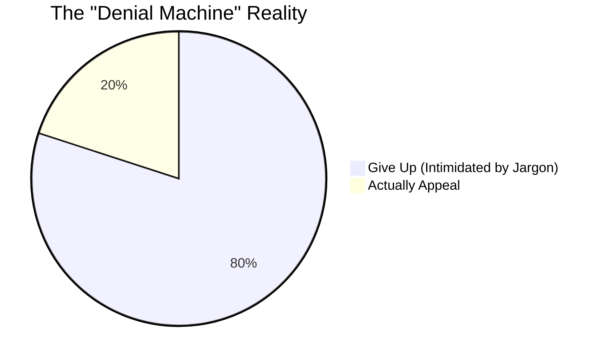
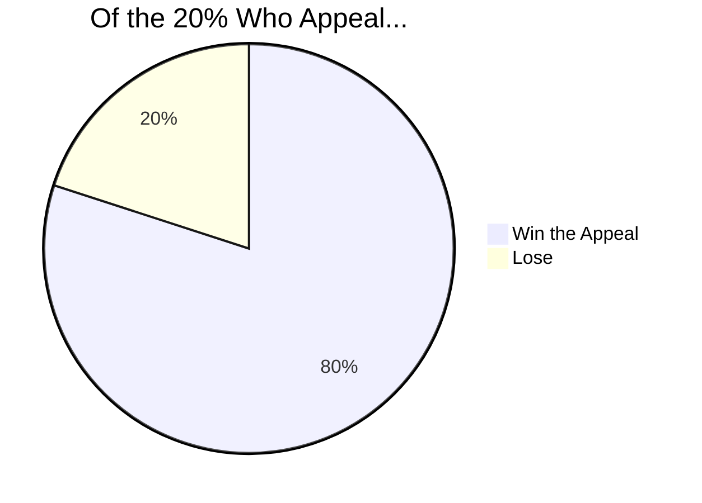

  
  <h1>UnDenied</h1>
  <h3>The AI-Powered Legal Translator & Appeal Strategist</h3>
  
<em>Official Submission for the <strong>Creator Colosseum Startup Competition</strong></em>

  
  
  
  
  
   

---

## Executive Summary

**UnDenied** is a revolutionary civic-tech startup that empowers ordinary people to fight back against confusing, jargon-filled official letters. By leveraging cutting-edge AI, we translate complex legalise into actionable, plain-language appeal strategies. We are levelling the playing field against billion-dollar corporations and bureaucratic machines.

---

## Required Competition Questionnaire 

### What is your startup idea?
**UnDenied** is a comprehensive web application and AI-powered legal analysis platform. When individuals receive intimidating official documents—such as insurance claim denials, eviction notices, medical bills, or benefits rejections—they can upload them to UnDenied. Our system instantly translates the complex legalese into plain language, highlights critical deadlines, and generates a personalized, step-by-step, actionable appeal strategy. 

### What is the problem you are solving and why it matters?
Every year, hundreds of millions of official letters are sent to individuals, intentionally drafted by lawyers to be as confusing as possible. This creates a massive "justice gap."
- **The Data Reality:** 80% of people never appeal wrongful decisions. Yet, of the 20% who do appeal, **80% win their cases**.
- **The Human Cost:** Most denials are inherently wrongful, but people surrender simply because they do not understand the letter. 
- **The Victims:** The most vulnerable populations—low-income families, elderly individuals, immigrants, and single mothers—are disproportionately targeted by this systemic issue. 

This bureaucratic intimidation tactics cost everyday people billions of dollars annually. We are solving a massive information asymmetry problem.

### What is your solution and how does it work?
UnDenied completely automates the legal discovery and appeal strategy pipeline for the average consumer, using our proprietary **Document Analyzer** powered by the Google Gemini API.

**How the user flow works:**
1. **Upload:** Users securely upload their official letters (PDF, JPG, PNG).
2. **AI Analysis:** Our engine parses the document to identify the core determination, legal grounds, appeal rights, and hidden deadlines.
3. **Translation:** The system outputs a jargon-free, plain-language explanation of what the letter actually means.
4. **Actionable Strategy:** UnDenied generates a tailored, step-by-step tactical plan on how to fight back and win the appeal.

We also feature **"The Denial Machine,"** an interactive data visualization platform exposing systemic denial trends, and a comprehensive **Knowledge Center** built with an award-winning, state-of-the-art cinematic web UI.

### What is your basic execution or business plan describing how the idea could realistically be developed?
Our execution plan is designed for high impact, low friction, and sustainable scalability:
* **Phase 1: Proof of Concept & Validation (Current):** We have built a fully functional web prototype with live AI integration. Initially released as a free public-service tool to gather anonymized proprietary data on recurring denial patterns and build high user trust.
* **Phase 2: Freemium B2C Model:** The core translation and strategy analysis will remain free. We will introduce premium features ($5-$10/report or a low-cost subscription tier) that auto-generate formatted, ready-to-mail appeal complaint drafts, handle direct physical mailing, and offer "Ask an Expert" human reviews.
* **Phase 3: B2B & Enterprise Partnerships:** License our anonymized data and API to consumer advocacy groups, NGOs, labor unions, and legal aid clinics as a white-labeled tool. They can sponsor the platform to deploy it to their constituents at scale, providing us with recurring enterprise revenue.

### Identification of your target users or market
Our target market is the everyday consumer facing a bureaucratic wall. Specifically:
- **Patients** fighting predatory medical debt or bad-faith health insurance denials.
- **Tenants** navigating complex eviction threats, unfair fines, or lease disputes.
- **Citizens** dealing with wrongful government benefit rejections (Unemployment, SNAP, Disability).

**Total Addressable Market (TAM):** Virtually every adult in the US (and globally) will receive an unfair bureaucratic denial, medical bill, or confusing official notice in their lifetime. This is a multi-billion dollar unmet need in the legal-tech sector.

---

## The Proof: Why UnDenied Works

*Our platform bridges that 80% gap by removing the intimidation factor.*

---

## Technical Implementation

We don't just have an idea; we have functioning code. Our stack is modern, scalable, and built for speed.

* **Frontend:** HTML5, CSS3, JavaScript (ES6+), GSAP (for cinematic 3D animations), D3.js (Interactive Data Viz).
* **Backend:** Python Web Framework (Flask/FastAPI).
* **AI Engine:** Google Gemini API for state-of-the-art NLP and document contextualization.
* **Architecture:** Secure, responsive, cross-platform, WCAG accessibility compliant.

### Public GitHub Repository
**[Link to GitHub Repository]** *(Replace with actual link)*

---

## Pitch & Demo

**Recommended Competition Materials:**
- **[Watch our 5-Minute Pitch Video Here]** *(Replace with actual link)*
- **[View our Figma Designs/Prototypes Here]** *(Replace with actual link)*

---

## Judging Criteria Alignment

| Criteria | How UnDenied Excels |
| :--- | :--- |
| **Feasibility & Execution (25%)** | We have a working technical prototype integrating real AI (Gemini). It’s not just mockups. The business plan scales logic from free public service to B2B white-labeling. |
| **Potential Impact (25%)** | Solves a universal, painful problem affecting millions of vulnerable people. Direct, measurable financial and emotional relief for users fighting wrongful denials. |
| **Communication & Clarity (10%)** | Our pitch, this documentation, and the cinematic UI of the actual app are designed to communicate complex ideas simply—which is the exact mission of our product. |
| **Effort & Work Ethic (40%)** | We hand-coded a sophisticated Vanilla JS/CSS cinematic UI without relying on heavy bloatware frameworks, integrated real AI architectures, and created a comprehensive business model. |

---

  <i>"They expect you to give up. We make sure you don't."</i>
    
  <b>Built by Student Founders for the Creator Colosseum.</b>

